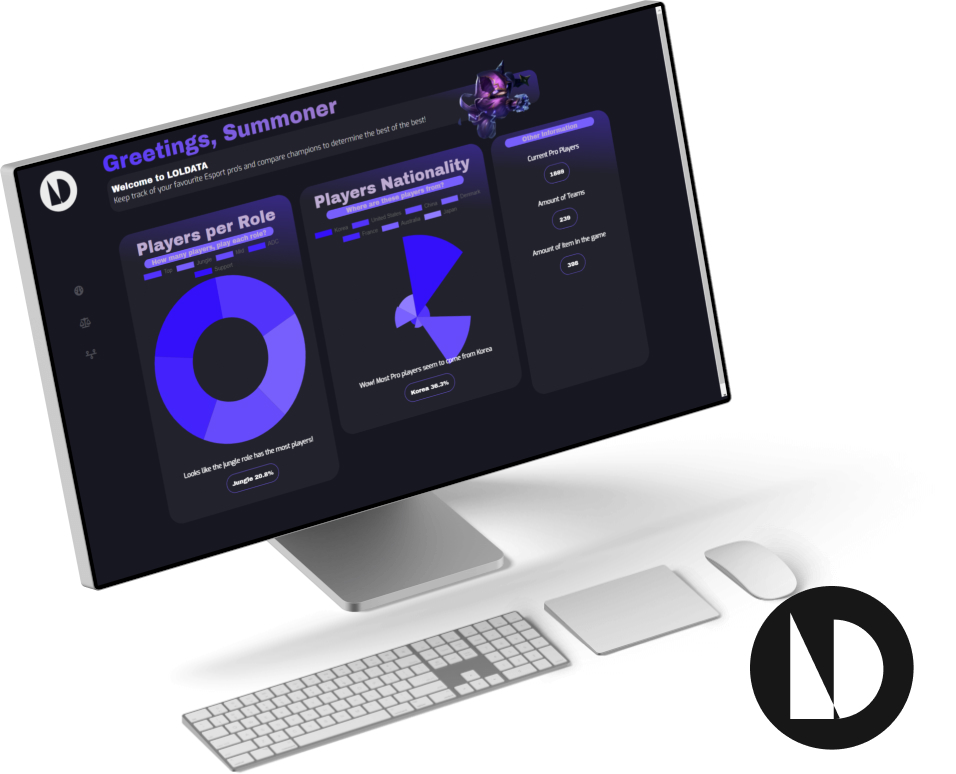
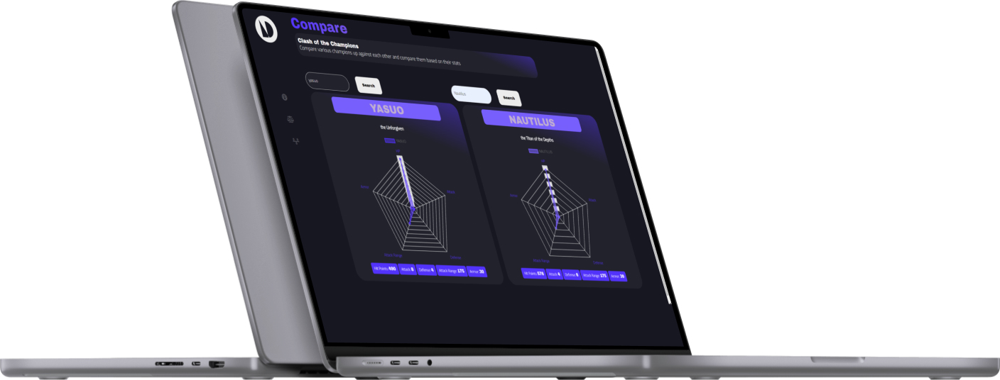
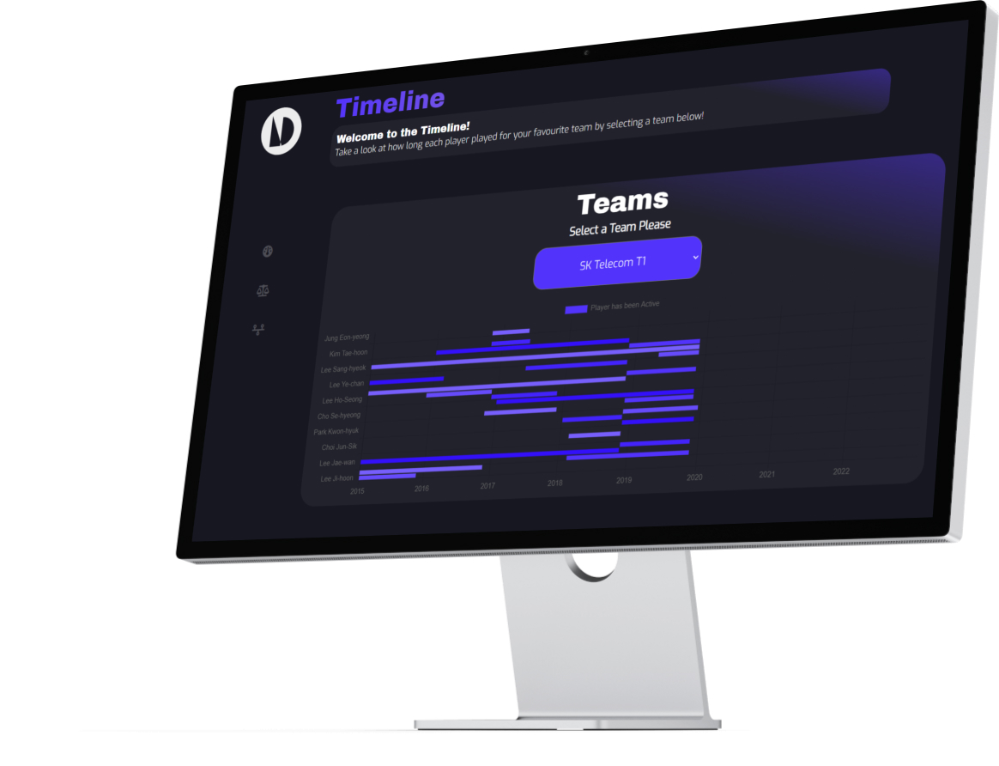

<!-- REPLACE ALL THE [WiaanDuvenhage-200307] TEXT WITH YOUR GITHUB PROFILE NAME & THE [loldata] WITH THE NAME OF YOUR GITHUB PROJECT -->

<!-- Repository Information & Links-->
<br />


<!-- HEADER SECTION -->
<h5 align="center" style="padding:0;margin:0;">Wiaan Duvenhage</h5>
<h5 align="center" style="padding:0;margin:0;">200307</h5>
<h6 align="center">DV200 - Term 1</h6>
</br>
<p align="center">

  <a href="https://github.com/WiaanDuvenhage-200307/loldata">
    
  </a>
  
  <h3 align="center">LOLDATA</h3>

  <p align="center">
    A React project built using React, Node.js & Chart.js 2 and an API of my choice. <br>
    
   <br />
   <br />
   <a href="">View Demo</a>
    ·
    <a href="https://github.com/WiaanDuvenhage-200307/loldata/issues">Report Bug</a>
    ·
    <a href="https://github.com/WiaanDuvenhage-200307/loldata/issues">Request Feature</a>
</p>
<!-- TABLE OF CONTENTS -->

## Table of Contents

- [About the Project](#about-the-project)
  - [Project Description](#project-description)
  - [Built With](#built-with)
- [Getting Started](#getting-started)
  - [Prerequisites](#prerequisites)
  - [How to install](#how-to-install)
- [Features and Functionality](#features-and-functionality)
- [Concept Process](#concept-process)
  - [Ideation](#ideation)
  - [Wireframes](#wireframes)
  - [Custom UI](#user-flow)
- [Development Process](#development-process)
  - [Implementation Process](#implementation-process)
    - [Highlights](#highlights)
    - [Challenges](#challenges)
  - [Future Implementation](#peer-reviews)
- [Final Outcome](#final-outcome)
  - [Mockups](#mockups)
  - [Video Demonstration](#video-demonstration)
- [Conclusion](#conclusion)
- [License](#license)
- [Contact](#contact)
- [Acknowledgements](#acknowledgements)

<!--PROJECT DESCRIPTION-->

## About the Project

<!-- header image of project -->



### Project Description

Welcome to loldata, a cool project I built using React, Node.js, chart.js 2 and a League of Legends API that I got from sportsdata.io. View the documentation <a href="https://sportsdata.io/developers/api-documentation/lol">here</a> .

### Built With

- [React](https://reactjs.org/)
- [Chart.js 2](https://www.chartjs.org/)
- [JavaScript](https://www.javascript.com/)
- [Node.js](https://nodejs.org/en/)
- [League of Legends Sportsdata.io API](https://sportsdata.io/)

<!-- GETTING STARTED -->
<!-- Make sure to add appropriate information about what prerequesite technologies the user would need and also the steps to install your project on their own mashines -->

## Getting Started

The following instructions will get you a copy of the project up and running on your local machine for development and testing purposes.

### Installation

Here are a couple of ways to clone this repo:

1.  GitHub Desktop </br>
    Enter `https://github.com/WiaanDuvenhage-200307/loldata.git` into the URL field and press the `Clone` button.

2.  Clone Repository </br>
    Run the following in the command-line to clone the project:

    ```sh
    git clone https://github.com/WiaanDuvenhage-200307/loldata.git
    ```

        Open `Software` and select `File | Open...` from the menu. Select cloned directory and press `Open` button

3.  Install Dependencies </br>
    Run the following in the command-line to install all the required dependencies:

    ```sh
    npm install axios
    ```

    ```sh
    npm install react-chartjs-2 --save
    ```

    ```sh
    npm install react-router-dom
    ```

    ```sh
    npm install react-browser-router --save
    ```

4.  An API key IS required for this app to work. You would need to register on Sportsdata.io first <a href="https://sportsdata.io/user/register">here</a>.

<!-- FEATURES AND FUNCTIONALITY-->
<!-- You can add the links to all of your imagery at the bottom of the file as references -->

## Features and Functionality

<!-- note how you can use your gitHub link. Just make a path to your assets folder -->

### All the characters shown on Rick and Morty!

Using the Rick and Morty API, we are displaying the characters, which the user can randomise again.

### Feature 2

Using 2 `.json` files that I created, you complete a quiz, which will give you the best episode to watch based on your answers.

### Feature 3

Using `.php` I have added a feedback form to send any emails to me on changes that I can implement on this project.

<!-- CONCEPT PROCESS -->
<!-- Briefly explain your concept ideation process -->
<!-- here you will add things like wireframing, data structure planning, anything that shows your process. You need to include images-->

## Concept Process

For my conceptual process, I took a look at websites such as Behance, Pinterest and Siteinspire. I also watched a few Rick and Morty episodes and took a look at the colors and played around with them in Figma and looked at sites like cooolors.co to have a sense of a good color palette.

## Development Process

The `Development Process` is the technical implementations and functionality done in the frontend and backend of the application.

### Implementation Process

<!-- stipulate all of the functionality you included in the project -->
<!-- This is your time to shine, explain the technical nuances of your project, how did you achieve the final outcome!-->
<!-- TODO : Change this! -->

- I used Bulma to implement resposiveness to my web app, so that it can be viewable on both desktop and mobile.

- I created a quiz and using logic I made that when you enter a question it goes to another question and upon completing the quiz, it will give you an episode of Rick and Morty to watch (it is randomized). I displayed the question using a `.json` file that I created myself and jQuery `.fadeIn()` & `.hide()` events to show questions I have not answers and hide those that I have answered while simultaneously appending pictures for the questions to the dom from a `.json` file that I also created and populated.

- For my character list I created getJSON() function that will get all the data from the characters. Inside of that function I then appended them to the DOM with the relative styling in a card format using Bulma's card default styling properties. I then wrote some logic to display their status in different colors. For example, I wrote an if() that would check if the status name is strongly equals to dead and append it to the dom and make a red block around the word "dead" and did an else if for the status name alive and unknown.

- Furthermore, I appended the characters to the dom and added a "give me more characters" button which will generate a new set of characters. To do this I created a `const` variable that had a `Math.floor(Math.random())` function assigned to it that gave me a random number between 1 and 43, which was the page numbers of all the characters (You access the characters and their relative data according to a page number in the API endpoint). I then concatenated this random number variable with my API endpoint and appended that randomnumber function, using jQuery's `.click()` event to run whenever the user clicks on the "give me more characters" button, after the user clicks the whole page reloads. I did that by adding a `window.location.reload();` function that I bound to the "give me more characters" button.

#### Highlights

<!-- stipulated the highlight you experienced with the project -->

- The highlight of this project was definitely working with React and Chart.js, implementing them and seeing how components work together along with the API data to create a sleek front-end design.

#### Challenges

<!-- stipulated the challenges you faced with the project and why you think you faced it or how you think you'll solve it (if not solved) -->

- I struggled a lot to grasp the idea of React props, it is still something I do not fully understand but will dig into research and mini courses on the web and start learning how props really work.
- I could not figure out why my data on my timeline component would only render after I inspect the page or zoom out/in.
- I struggled with getting a final design/ color scheme going, but by help from my lecturer and tools online, I could overcome that obstacle.
- I could not implement a current time, I kept getting an error message.
- I also could not implement a preloader that loads whilst waiting for the API data to load, but it is something that I will be researching.
- Something I also found tricky with, was implementing data on the timeline page and making it work with the type of chart that I used on that page, but help from peers got me through it.

#### Above And Beyond

<!-- TODO Change this! -->

The aspects that I learned outside of lecture time and the brief, is that I learned a new framework called Bulma to make my website responsive. We were learnt Twitter Bootstrap but I wanted to go a different route and learn and implement Bulma, just to go that extra mile. It was hard but I managed to wrap my head around the framework. I lea

### Future Implementation

<!-- TODO Change this! -->

<!-- stipulate functionality and improvements that can be implemented in the future. -->

- My future implementation is to redo the entire test page and make it look more sleek and have better UX
- I would also most likely redo this entire project, because it is not created and presented to my standard. I will most probably redo the project using a different framework like Tailwind CSS or a framework I am familiar with, which is Bootstrap.

<!-- MOCKUPS -->

## Final Outcome

### Mockups

<!-- TODO Change this -->




<br>

<!-- VIDEO DEMONSTRATION -->

### Video Demonstration

<!-- TODO Change this -->

To see a run through of the application, click below:

[View Demonstration](https://youtu.be/BMsNp2b9rIk)

See the [open issues](https://github.com/WiaanDuvenhage-200307/loldata/issues) for a list of proposed features (and known issues).

<!-- AUTHORS -->

## Authors

- **Your Name & Surname** - [Wiaan Duvenhage](https://github.com/WiaanDuvenhage-200307)

<!-- LICENSE -->

## License

Distributed under the MIT License. See `LICENSE` for more information.\

<!-- LICENSE -->

## Contact

- **Wiaan Duvenhage** - [wiaanduvenhage.dev@gmail.com](mailto:wiaanduvenhage.dev@gmail.com) - [@double.u.dee.designs](https://www.instagram.com/double.u.dee.designs/)
- **Project Link** - https://github.com/WiaanDuvenhage-200307/loldata

<!-- ACKNOWLEDGEMENTS -->

## Acknowledgements

<!-- all resources that you used and Acknowledgements here -->
<!-- TODO Change this -->

- [League of Legends API Docs](https://sportsdata.io/developers/api-documentation/lol)
- [Stack Overflow](https://stackoverflow.com/)
- [Bulma Documentation](https://bulma.io/documentation/)
- [Cooolors](https://coolors.co/)
- [Figma](https://www.figma.com/)
